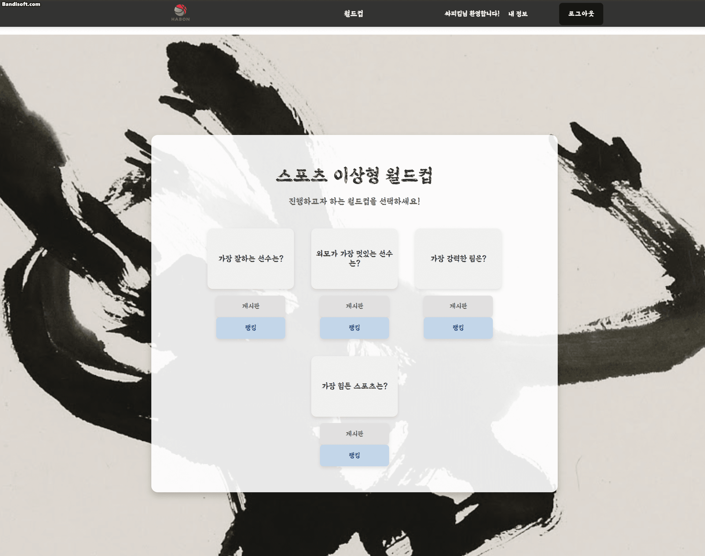
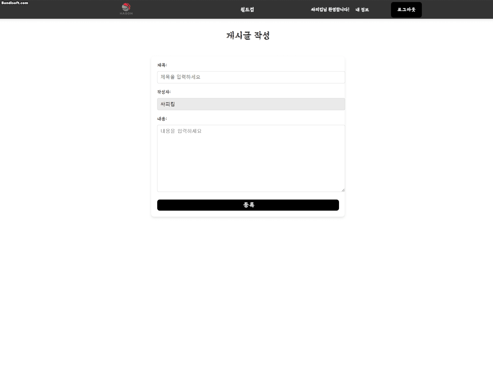

<h2>ssafy 1st project 🚩</h2>
SSAFY FIRST PROJECT - 스포츠 팬들을 위한 아상형월드컵 커뮤니티
  

 

## 📑 개요

- 프로젝트 명 : HABON PROJECT
- 프로젝트 한 줄 소개 : 신뢰성을 강조한 스포츠 이상형 월드컵 기반의 토론 사이트
- 프로젝트 일시 : 2024.05.16 ~ 2024.05.24 (9일)
   

## 👥 멤버 소개

|  |  |
| :--------------------------------------------------------------: | :------------------------------------------------------------------: |
|                              박예본                              |                                하정수                                |

 

## 🚩 팀 공통 목표 및 개발환경

- 사람들의 경쟁심을 이끌어 내기 위한 이상형월드컵 토론사이트
- Front : Vue.js, JavaScript
- Back : SpringBoot, MyBatis
- 협업 툴 : Discord, Git, Github
   

## 🔍 서비스 소개

 

### 메인화면
<table>
    <tr>
        <th>메인</th>
    </tr>
    <tr>
        <td></td>
    </tr>
</table>

 

### 로그인화면 및 회원가입
<table>
    <tr>
        <th>로그인</th>
        <th>로그인성공</th>
    </tr>
    <tr>
        <td></td>
        <td></td>
    </tr>
</table>
<table>
    <tr>
        <th>회원가입화면</th>
    </tr>
    <tr>
        <td></td>
    </tr>
</table>
 

### 이상형월드컵
<table>
    <tr>
        <th>월드컵 메인</th>
        <th>월드컵 라운드선택</th>
    </tr>
    <tr>
        <td></td>
        <td></td>
    </tr>
</table>
<table>
    <tr>
        <th>월드컵 진행</th>
    </tr>
    <tr>
        <td></td>
    </tr>
</table>
 

### 월드컵결과 및 순위
<table>
    <tr>
        <th>랜덤포인트</th>
        <th>선수순위</th>
    </tr>
    <tr>
        <td></td>
        <td></td>
    </tr>
</table>
<table>
    <tr>
        <th>해당 월드컵 게시판</th>
    </tr>
    <tr>
        <td></td>
    </tr>
</table>
 

### 게시판
<table>
    <tr>
        <th>글작성화면</th>
        <th>글작성후</th>
    </tr>
    <tr>
        <td></td>
        <td></td>
    </tr>
</table>
<table>
    <tr>
        <th>게시판상세</th>
        <th>글 삭제</th>
    </tr>
    <tr>
        <td></td>
        <td></td>
    </tr>
</table>
<table>
    <tr>
        <th>신고</th>
    </tr>
    <tr>
        <td></td>
    </tr>
</table>
 

### 내정보 및 이미지변경
<table>
    <tr>
        <th>내정보화면</th>
        <th>이미지변경</th>
    </tr>
    <tr>
        <td></td>
        <td></td>
    </tr>
</table>
 

## 📌 겪었던 어려움과 해결 과정

- Front와 Back 에서의 호스트주소가 서로 달라서 로그인 시 필요한 SessionStorage가 서로 달라 맞추는데 어려움을 겪었습니다. 이후로는 토큰을 사용하여 로그인 구현을 해야겠다는 생각을 했습니다.
- 월드컵의 요소들을 랜덤으로 나오게 하는 구현이 어려웠습니다.

 

## 💓 소감

> 하정수

- 일주일 조금 넘는 시간동안 정말 많이 배우고 재밌는 시간 가졌던 것 같습니다. 앞으로는 개발을 하기 전에 초기 구상을 더 깔끔하고 상세하게 해야 개발에 드는 시간을 단축시킬 수 있을 것 같다고 생각했습니다!
